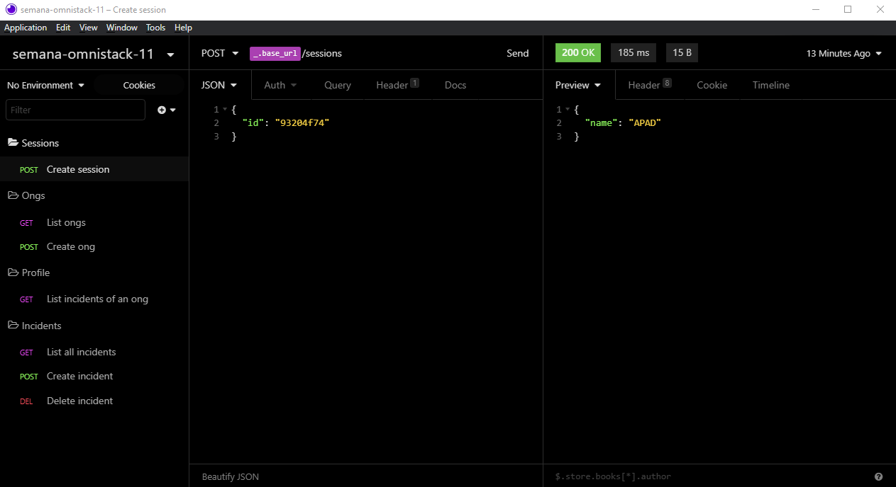

<h1 align="center">
    
</h1>

    

## :rocket: Tecnologias

Foram usadas as seguintes tecnologias:

- [Node.js](https://nodejs.org/en/)
- [React](https://reactjs.org)
- [React Native](https://reactnative.dev)
- [Expo](https://expo.io)

## :computer: Projeto

Desenvolvido durante a semana omnistack 11 pela [Rocketseat](https://rocketseat.com.br), com o objetivo de conectar pessoas que desejam fazer contribuições monetárias a ONG's(Organizações não governamentais) que precisam de ajuda.
Uma das novidadades no projeto que diferencia das edições anteriores, é a utilização do banco de dados sqlite, utilizando o Query Builder [Knex.js](http://knexjs.org) no ambiente Node.js. Se quiser aprender como utilizar o Knex nos seus projetos, se liga nesse [video da Rocketseat](https://www.youtube.com/watch?v=U7GjS3FuSkA).

## :thinking: Como acessar a API?

<h1 align="center">
    
</h1>

Baixo o [Insomnia](https://insomnia.rest), clique em `Application > Preferences > Data > Import Data > From URL`, e cole a seguinte url **`asdasgagagfa`**

#### :warning: Dicas para utilizar a API

1. Primeiramente crie uma ong - rota **Create ong**.
2. Use o id desta ong para testar a rota **Create sessions**.
3. Na rota **List incidents of an ong** passar o id de uma ong no **Header**, no parâmetro **authorization**, para listar os casos dessa ong.
4. Na rota **List all incidents**, o parâmetro **page** no **Query**, corresponde ao número da página, pois são listados 5 incidentes por página.
5. Na rota **Create incident**, o parâmetro **authorization** no **Header**, é o id de uma ong e funciona como relação a tabela ong e a tabela incidents.
6. Na rota **Delete incident**, passar o id do incidente na própria rota, e o **authorization** que é o id da ong, pois um incidente só pode ser deletado pela sua respectiva ong.